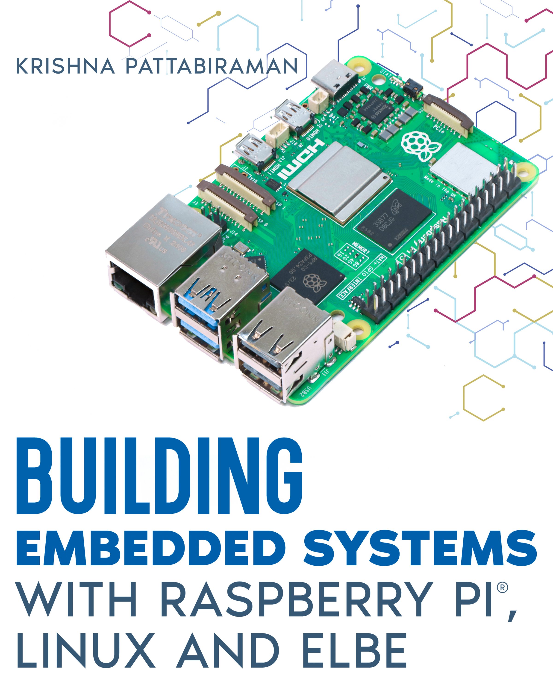

# Building Embedded Systems with Linux, Raspberry Pi and ELBE

A practical guide to building **reproducible embedded Linux systems** using the **ELBE build environment** and **Raspberry Pi**.

---

## Overview

*Building Embedded Systems with Linux, Raspberry Pi and ELBE* focuses on practical workflows for constructing Debian-based embedded Linux systems using the **ELBE (Embedded Linux Build Environment)**.

Instead of distributing static system images, the book demonstrates how to treat the operating system as a **reproducible build artifact**, allowing developers to consistently generate root filesystems and system images.

The examples use **Raspberry Pi** as the primary development platform, enabling readers to experiment with embedded Linux development on accessible hardware.

The book provides step-by-step guidance on configuring build environments, customizing systems, and creating deployable embedded Linux images.

---

## What You Will Learn

- Building embedded Linux systems using **ELBE**
- Creating reproducible root filesystems with **Debian**
- Managing packages and customizing system images
- Generating deployable **Raspberry Pi** system images
- Working with modern storage configurations
- Integrating containers and virtualization environments
- Developing structured build workflows for embedded Linux projects

---

## Practical Recipes Included

Hands-on build recipes include:

- Docker build environments
- Desktop environments
- QEMU ARM virtual platforms
- Raspberry Pi minimal images
- Btrfs filesystems
- OverlayFS and SquashFS systems
- Encrypted filesystems
- Podman container environments
- Custom Raspberry Pi kernel builds
- LLM development machine on Raspberry Pi 5
- ROS2 development environment

---

## Example Code

All ELBE build recipes used in the book are available on GitHub:

**ELBE Cookbook Recipes**

https://github.com/rootfx-io/elbe-cookbook-recipes

These examples allow readers to reproduce the systems described in the book and experiment with ELBE-based embedded Linux workflows.

---

## Foreword

The foreword was written by **John Ogness**, core developer and original contributor to the ELBE project at Linutronix.

---

## Sponsor

This work was sponsored by **AFRA GmbH**, a software engineering company based in Erlangen, Germany specializing in embedded and automation systems.

https://www.afra.de

---

## Availability

The book is available in printed and digital formats.

📖 **Book link**

https://kdpbook.link/for/3982834406

---

## About the Author

Krishna Pattabiraman is an embedded systems technologist with nearly two decades of professional experience in Linux-based product development. His work spans embedded Linux system architecture, kernel customization, system integration, and deployment across multiple industries.

He is passionate about creating practical tools and sharing hands-on engineering knowledge with developers and learners in the embedded Linux community.

---

## Related Resources

- ELBE Build Environment  
  https://elbe-rfs.org

- Raspberry Pi Platform  
  https://www.raspberrypi.com

- Debian Project  
  https://www.debian.org
